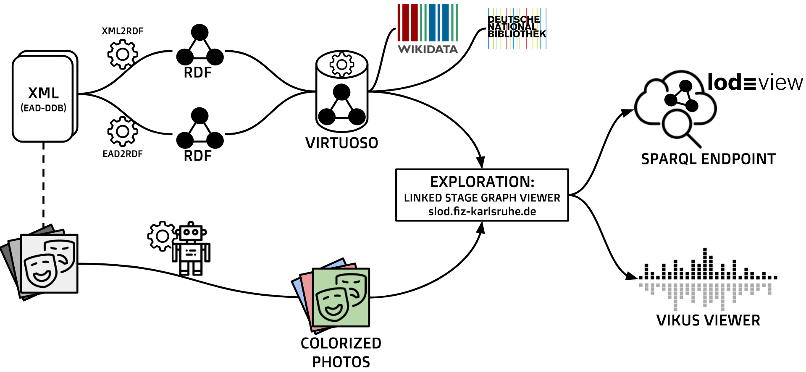

# Linked Stage Graph

Demo Webpage: [slod.fiz-karlsruhe.de](http://slod.fiz-karlsruhe.de)

Linked Stage Graph is a Knowledge Graph developed as part of the [Coding da Vinci Süd 2019](https://codingdavinci.de/events/sued/) hackathon taking place from April 06 to May 18, 2019.

The graph is being created using a dataset provided by the [National Archive of Baden-Wuerttemberg](https://www.landesarchiv-bw.de/web). It contains black and white photographs and metadata about the Stuttgart State Theatre from the 1890s to the 1940s. The nearly 7.000 photographs give vivid insights into on-stage events like theater plays, operas and ballet performances as well as off-stage moments and theater buildings. 

However, the images and the data set as they are currently organized are hard to use and explore for anyone who is unfamiliar with an achive’s logic to structure information. This project proposes means to explore and understand the data by humans and machines using linked data standards and interesting visualizations.

